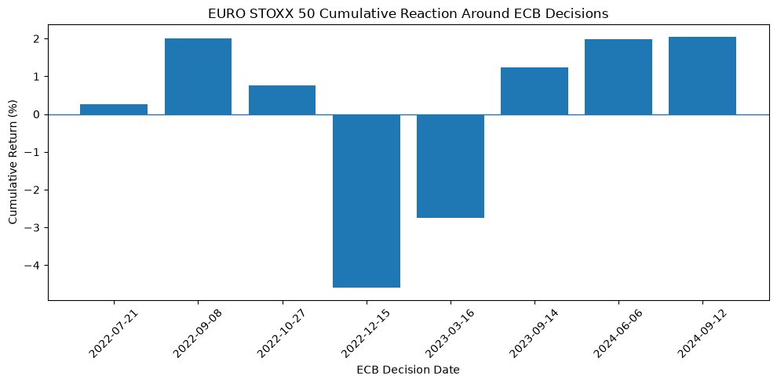

# Euro Area Macro & Markets Analysis

A Python project examining how euro-area inflation and monetary policy relate to European equities, government bond yields and EUR/USD. It combines monthly analysis across markets with a descriptive event study of eight ECB decisions between 2022 and 2024.

**Tools:** Python, pandas, NumPy, Matplotlib, yfinance and Jupyter Notebook.

[Open the full analysis, including charts and saved outputs](notebooks/Euro_Area_Macro_Markets_Analysis_FINAL.ipynb).

## Main findings

The common monthly sample covers **January 2020–December 2025**: 72 monthly observations and 71 monthly equity and FX returns.

| EURO STOXX 50 metric | Result | Calculation |
|---|---:|---|
| Annualized arithmetic mean return | 9.46% | Mean monthly simple return × 12 |
| Annualized volatility | 17.90% | Sample standard deviation of monthly returns × √12 |
| Maximum drawdown at month-end | −23.46% | Largest decline from the previous running month-end peak |

The correlation between monthly equity returns and changes in the euro-area 10-year yield is approximately **−0.32** over the full sample. Its 12-month rolling correlation ranges from approximately **−0.74 to +0.27**, showing that the relationship varies over time. EUR/USD returns have a weak sample correlation with monthly changes in the ECB–Fed rate differential, approximately **−0.04**.

Across the eight selected ECB meetings, the largest negative three-day EURO STOXX 50 return occurred around **15 December 2022 (−4.59%)**, followed by **16 March 2023 (−2.74%)**. The two rate cuts included from 2024 coincided with equity returns of approximately **+2.0%**. The largest absolute EUR/USD movement was approximately **−1.05%**, around **14 September 2023**.



These are observed market movements around announcements. They do not isolate the effect of monetary policy from expectations or other market news.

## Data and coverage

| Variable | Source and identifier | Frequency used from source |
|---|---|---|
| EURO STOXX 50 | Yahoo Finance, `^STOXX50E`, downloaded with yfinance | Daily |
| EUR/USD | Yahoo Finance, `EURUSD=X`, downloaded with yfinance | Daily |
| Euro-area 10-year government benchmark bond yield | [ECB Data Portal](https://data.ecb.europa.eu/data/datasets/FM/FM.M.U2.EUR.4F.BB.U2_10Y.YLD), `FM.M.U2.EUR.4F.BB.U2_10Y.YLD` | Monthly |
| Euro-area all-items HICP inflation, annual rate of change | [Eurostat](https://ec.europa.eu/eurostat/databrowser/view/prc_hicp_manr/default/table?lang=en), `PRC_HICP_MANR` | Monthly |
| ECB Deposit Facility Rate | [ECB Data Portal](https://data.ecb.europa.eu/data/datasets/FM/FM.D.U2.EUR.4F.KR.DFR.LEV), `FM.D.U2.EUR.4F.KR.DFR.LEV` | Daily |
| Effective Federal Funds Rate | Federal Reserve Bank of New York, via [FRED](https://fred.stlouisfed.org/series/EFFR), `EFFR` | Daily |

Daily market data are requested from **1 January 2020 through 31 August 2026**. The four institutional source CSVs are included in `data/`; the supplied HICP file ends in December 2025, which limits the common monthly dataset to that date. Its geographic label is “Euro area – 20 countries (2023–2025)”.

The event study uses a separate daily download from January 2022 through September 2024. It covers these eight meeting dates: 21 July, 8 September, 27 October and 15 December 2022; 16 March and 14 September 2023; and 6 June and 12 September 2024.

## Method

1. **Prepare the data.** Select closing prices from Yahoo Finance downloads with `auto_adjust=True`. Take the last available market price and policy-rate observation in each month, then align the monthly series by their common dates.
2. **Measure performance and risk.** Calculate simple equity and FX returns, annualized equity statistics and drawdowns from month-end index levels. Express bond-yield changes in basis points and changes in inflation and policy rates in percentage points.
3. **Compare markets.** Calculate Pearson correlations, a 12-month rolling equity/yield correlation, and the differential between the ECB Deposit Facility Rate and the Effective Federal Funds Rate. Compare EUR/USD returns with changes in that differential.
4. **Examine ECB meetings.** Compound daily equity and FX returns over a `[-1, 0, +1]` window around each selected meeting: the preceding observation, announcement date and following observation in the aligned daily dataset. Rank events by the absolute cumulative return.

## Interpretation and limitations

- The event study reports **raw cumulative returns**, with no estimated benchmark, abnormal returns, significance tests or causal identification. Eight selected meetings provide a descriptive sample.
- Daily observations do not isolate announcement-time surprises. Equity and FX trading calendars and closing conventions differ; adjacent rows in the combined dataset need not represent identical trading sessions for both assets.
- The annualized mean return is an arithmetic statistic, **not CAGR**. Drawdown uses month-end observations and can miss larger declines within a month. Returns use the supplied index-price series; dividend reinvestment and investment costs are not separately modelled.
- Correlations describe associations. The inflation file contains historical observations rather than a release-time dataset, so this analysis does not model which information was available to investors at each date. It is not a trading-strategy backtest.

## Project files

```text
Euro_Area_Macro_Markets_Final/
├── README.md
├── requirements.txt
├── charts/
│   └── ecb_equity_event_returns.png
├── notebooks/
│   └── Euro_Area_Macro_Markets_Analysis_FINAL.ipynb
└── data/
    ├── ecb_deposit_facility_rate.csv
    ├── euro_area_10y_yield.csv
    ├── euro_area_hicp_inflation.csv
    ├── fed_funds_rate.csv
    ├── macro_market_data.csv          # generated monthly dataset
    └── ecb_event_study.csv            # generated event results
```

## Run the analysis

The notebook was executed successfully with **Python 3.13.2**. The direct dependencies in [requirements.txt](requirements.txt) are pinned to the versions in that environment; transitive dependencies are not fully locked.

After extracting the project or cloning its repository, open a terminal in the folder containing this README. On macOS or Linux, with Python 3.13 installed:

```bash
python3.13 -m venv .venv
source .venv/bin/activate
python -m pip install -r requirements.txt
python -m ipykernel install --sys-prefix --name euro-area-macro --display-name "Python (Euro Area Macro)"
python -m notebook
```

Open `notebooks/Euro_Area_Macro_Markets_Analysis_FINAL.ipynb`, select **Python (Euro Area Macro)** as the kernel, restart it and run all cells from top to bottom. Keep the `notebooks/` and `data/` folders in their existing relative positions: data paths are resolved from the notebook folder.

An internet connection is required for the Yahoo Finance downloads. The institutional CSVs are read locally. Running the notebook regenerates and overwrites the two derived files, `data/macro_market_data.csv` and `data/ecb_event_study.csv`; it does not modify the four source CSVs. The README chart is a static export of the saved notebook output.

The saved notebook includes **11 charts**. Validation of the computational workflow checked that all eight events were present, the rate differential matched its input series, and compounded event returns agreed with the corresponding price ratios. Market data may be revised or temporarily unavailable, so later downloads can differ from the saved results.

For setup details, see the official [Jupyter installation guide](https://jupyter.org/install) and [IPython kernel instructions](https://ipython.readthedocs.io/en/stable/install/kernel_install.html).
